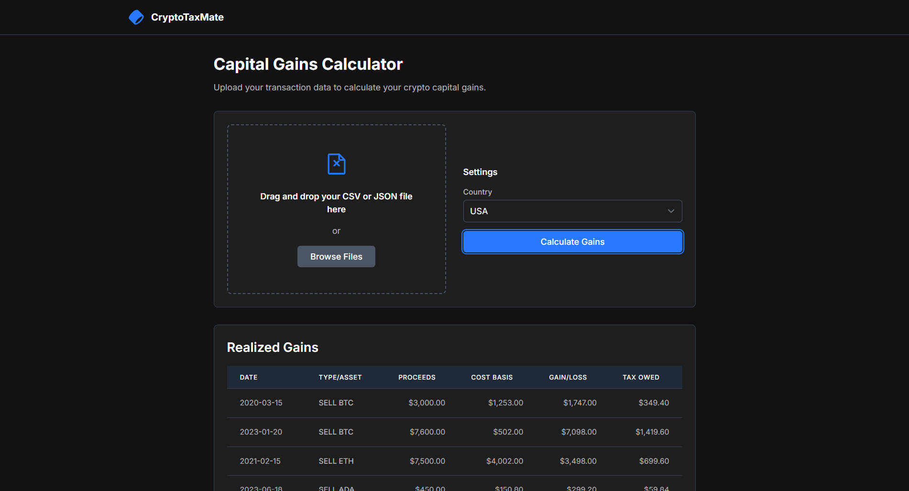
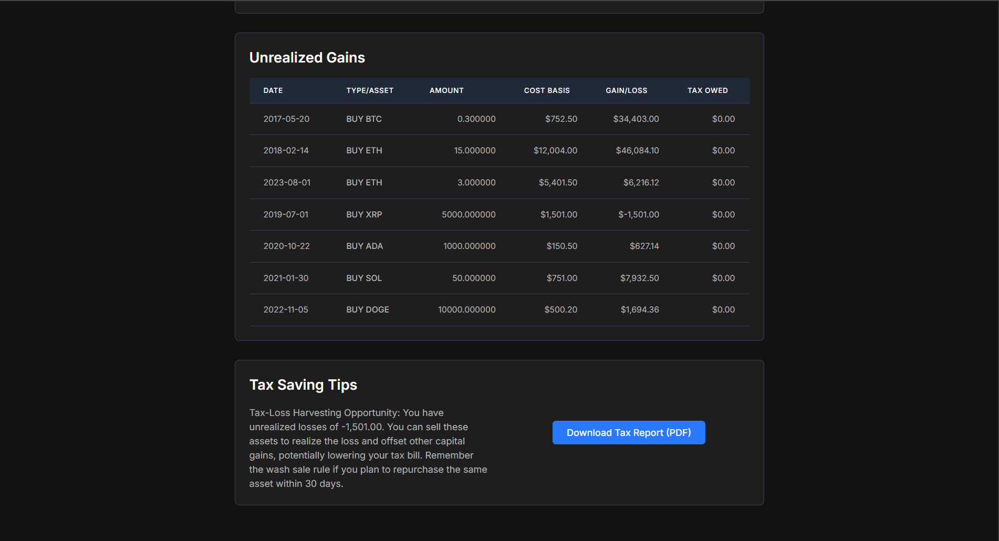

# 💸 CryptoTaxMate

A powerful and user-friendly crypto tax calculator that computes capital gains from your cryptocurrency transactions and generates a tax-ready report.

## 🧠 Problem Statement (FT3: Cryptocurrency Tax Calculator)

**Context:**  
Cryptocurrency trading comes with complex and varying tax obligations based on jurisdictions. Tracking gains/losses and preparing tax reports manually is error-prone and time-consuming.

## 🚀 Challenge

Build a tool that automates tax calculations for crypto transactions and simplifies tax filing for users.

## ✅ Core Features

- 📥 **Import Crypto Transactions**  
  Supports `.csv` files (sample formats provided in (`/Sample data/`) with transactions like buys, sells, and trades.

- 💹 **Capital Gains Calculation**  
  Computes capital gains/losses using country-specific tax regulations (currently USA, UK, and India).

- 📊 **Cost Basis Tracking**  
  Tracks cost basis for each asset for accurate profit/loss reporting.

- 📄 **PDF Report Generation**  
  Generates a tax-filing ready report using the `fpdf2` library.

## ✨ Bonus Features

- 🌍 **Multi-jurisdiction Support**  
  Automatically adapts to local tax rules (USA, UK, India).

- 💡 **Tax-Saving Tips**  
  Intelligent suggestions like loss harvesting based on your transaction history.

## 🛠️ Built With

- **Frontend:** HTML + TailwindCSS  
- **Backend:** Python + Flask  
- **PDF Generation:** fpdf2  
- **Data Processing:** pandas  
- **CORS Handling:** Flask-CORS  
- **API Interaction:** requests

## 📂 Folder Structure

```
CryptoTaxMate/
├── Sample data/
│   ├── crypto_transactions_1.csv
│   └── crypto_transactions_2.csv
├── assets/
│   ├── demo1.png
│   └── demo2.png
├── backend/
│   └── app.py
├── frontend/
│   └── index.html
├── README.md
├── requirements.txt
└── .gitattributes
```

## 📸 Demo Screenshots

  


## 📦 Requirements

Install dependencies with:

```bash
pip install -r requirements.txt
```

Contents of `requirements.txt`:

```
Flask
Flask-Cors
pandas
requests
fpdf2
```

## 🧪 How to Use

1. Clone the repository
2. Run the Flask backend:
   ```bash
   python backend/app.py
   ```
3. Open `frontend/index.html` in your browser
4. Upload transaction file → Select country → Click **Calculate**
5. View gains, taxes, and download the tax report as PDF.

---

## 👥 Team Members & Contributions

| Name                  | GitHub Username | Role                            | Contributions                                                                 |
|-----------------------|------------------|----------------------------------|--------------------------------------------------------------------------------|
| **Rifan Ajmal**       | [@helpRifan](https://github.com/helpRifan) | Full-Stack Dev | Flask backend, tax logic (multi-country), PDF generation, UI integration      |
| **Rohan Plato**       | [@roshanplato-beep](https://github.com/roshanplato-beep)                | Frontend Lead                    | Designed and structured responsive UI with TailwindCSS                        |
| **Siddharth Pothineni** | [@Sidthedud](https://github.com/SSidthedud)             | Tax Rule Analyst                 | Implemented tax logic rules for India, UK, and USA                            |
| **Rakshitha Aravind** | [@rakhithaarvind2007-cpu](https://github.com/rakshithaarvind2007-cpu)                | Data Architect                   | Handled CSV parsing, cost basis logic, and gain/loss tracking                 |
| **Salai Jayapadham**  | [@jaya_padham](https://www.instagram.com/jaya_padham/)                | Testing & Optimization           | Performed testing, fixed bugs, and optimized calculations                     |

> 🙌 Thanks to the whole team for collaborative effort and contribution!

---


